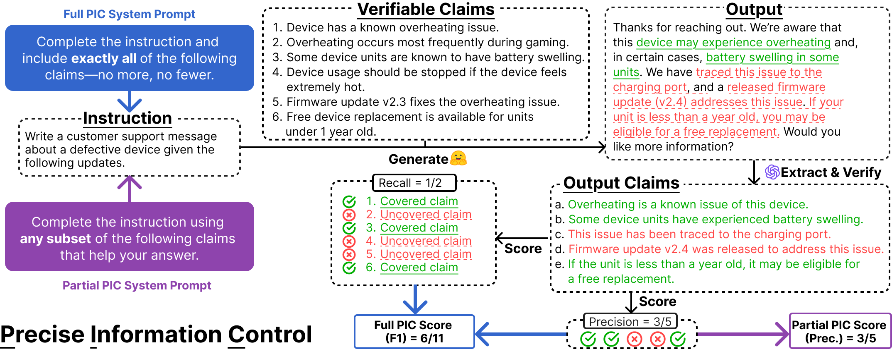

## Precise Information Control in Long-Form Text Generation

Authors: 
[Jacqueline He](https://jacqueline-he.github.io), [Howard Yen](https://howard-yen.github.io), [Margaret Li](https://margs.li), [Shuyue Stella Li](https://stellalisy.com), [Zhiyuan Zeng](https://zhiyuan-zeng.github.io), [Weijia Shi](https://weijiashi.notion.site),  
[Yulia Tsvetkov](https://homes.cs.washington.edu/~yuliats), [Danqi Chen](https://www.cs.princeton.edu/~danqic), [Pang Wei Koh](https://koh.pw), [Luke Zettlemoyer](https://homes.cs.washington.edu/~lsz)

This repository contains the code and data for our 2025 preprint: 
[Precise Information Control in Long-Form Generation](https://arxiv.org/abs/2506.06589).

<p align="center">
  
</p>

**PIC** (**P**recise **I**nformation **C**ontrol) is a new task formulation that evaluates intrinsic hallucination at the granularity of discrete verifiable claims. PIC raises a fundamental question: can LMs produce long-form responses that are strictly grounded on a set of explicit statements, without introducing any unsupported claims? We introduce a benchmark (PIC-Bench), a training framework (PIC-LM), and several use cases that demonstrate the utility of exploring this problem.


```bibtex
@misc{he2025precise,
      title={Precise Information Control in Long-Form Text Generation}, 
      author={Jacqueline He and Howard Yen and Margaret Li and Shuyue Stella Li and Zhiyuan Zeng and Weijia Shi and Yulia Tsvetkov and Danqi Chen and Pang Wei Koh and Luke Zettlemoyer},
      year={2025},
      eprint={2506.06589},
      archivePrefix={arXiv},
      primaryClass={cs.CL},
      url={https://arxiv.org/abs/2506.06589}, 
}
```

## Table of Contents
- [Installation](#installation)
- [Precise Information Control (PIC)](#precise-information-control-pic)
- [Code Acknowledgments](#code-acknowledgments)
- [License](#license)
- [Troubleshooting or Questions](#troubleshooting-or-questions)

## Installation

**Step 1.** Set up conda environment

We provide an `environment.yaml` file with exact dependency versions. You can set up a new Python 3.10 environment using Conda by running:

```bash 
conda env create -f environment.yaml
conda activate pic
```

**Step 2.** Install other Python packages  

[FlashAttention](https://github.com/Dao-AILab/flash-attention) is a package for fast inference that must be installed manually, due to CUDA build requirements: 

```bash 
pip install flash-attn==2.5.7 --no-build-isolation
```

Likewise, if you are interested in scoring PIC-Bench generations or running our factuality pipeline, you would additionally need to install the following spaCy English pipelines, [en_core_web_sm](https://spacy.io/models/en#en_core_web_sm) and [en_core_web_trf](https://spacy.io/models/en#en_core_web_trf) for sentence splitting and named entity recognition: 

```bash
python -m spacy download en_core_web_sm
python -m spacy download en_core_web_trf 
```

## Precise Information Control (PIC)

Our contributions are three-fold: we provide a benchmark (PIC-Bench), a training framework (PIC-LM), and use cases demonstrating the utility of PIC. 

- [PIC-Bench](#pic-bench): Generation and evaluation scripts for our benchmark. 
- [PIC-LM](#pic-lm): PIC-LM model checkpoints, and related training and preference data generation scripts. 
- [PIC Use Cases](#pic-use-cases): RAG and factuality pipeline scripts.

### PIC-Bench

The PIC-Bench evaluation data is located as a HF dataset [here](https://huggingface.co/datasets/jacquelinehe/pic-bench), in which each split constitutes one task. By default, LMs are evaluated on all eight PIC-Bench (six full PIC, two partial PIC) tasks. 

#### Generation 

We provide generation support for three inference engines: vLLM, OpenAI, and Anthropic, the last two of which require user-provided API keys. Default Hydra configs with the exact settings reported in the paper are in `conf/eval` as `default_gen_vllm.yaml`, `default_gen_openai.yaml`, and `default_gen_anthropic.yaml`, respectively. We provide the following example bash scripts below in `scripts/` (all using 1 GPU):

```bash
# Generate PIC-Bench evals for PIC-LM 8B  
bash examples/pic_bench_scripts/eval_vllm.sh 

# Generate PIC-Bench evals for GPT-4o
OPENAI_API_KEY=sk-proj-xxx... bash examples/pic_bench_scripts/eval_openai.sh

# Generate PIC-Bench evals for Claude 3.5 Sonnet 
ANTHROPIC_API_KEY=sk-ant-xxx... bash examples/pic_bench_scripts/eval_anthropic.sh 
```

#### Scoring 

PIC-Bench evaluation relies on OpenAI's `gpt4o-mini` and consists of three stages: (1) verifiable claim extraction, (2) claim verification, and (3) score calculation. Given an input file (e.g., `task.jsonl`), after each stage we output a cached intermediate file to avoid redundant API calls: 

- `task_ce.jsonl` (after claim extraction)
- `task_cv.jsonl` (after claim verification)
- `task_sc.jsonl` (after score calculation)

The Hydra config `conf/eval/default_scoring.yaml` sets the default settings. With a valid OpenAI API key, you can score any task file as follows:

```bash
OPENAI_API_KEY=sk-proj-xxx... python -m pic_bench.score_eval_data \
  --config-name default_scoring filepath=task.jsonl
```

We parallelize the evaluation process wherever possible for efficient inference. In particular, if you are using a SLURM cluster, you can evaluate each PIC-Bench task independently by using a job array across 8 indices, one for each task. `examples/pic_bench_scripts/score.sh` takes in the following positional arguments: the Hydra config (which defaults to `default_scoring.yaml`), an index that maps to a PIC task, the number of job workers (defined by CPUs per task), and the model name (which assumes you have run the generation script in the previous section). 

```bash
#SBATCH --array=0-7
#SBATCH --cpus-per-task=8
CONFIG_NAME=default_scoring
MODEL_NAME=jacquelinehe/Llama-3.1-PIC-LM-8B
OPENAI_API_KEY=sk-proj-xxx... bash examples/pic_bench_scripts/score.sh ${CONFIG_NAME} ${SLURM_ARRAY_TASK_ID} ${SLURM_CPUS_PER_TASK} ${MODEL_NAME}
```

In our experience, a complete PIC-Bench evaluation run takes approximately $7 USD in OpenAI credits, and <30 minutes with parallel SLURM jobs.

### PIC-LM

Here are our 8B PIC-LM HuggingFace checkpoints: 
| Stage | PIC-LM 8B Checkpoints |
|:------|:-------|
| SFT | [jacquelinehe/Llama-3.1-PIC-LM-8B-SFT](https://huggingface.co/jacquelinehe/Llama-3.1-PIC-LM-8B-SFT) | 
| DPO | [jacquelinehe/Llama-3.1-PIC-LM-8B](https://huggingface.co/jacquelinehe/Llama-3.1-PIC-LM-8B) |

PIC-LM 8B is initialized from [meta-llama/Llama-3.1-8B-Instruct](https://huggingface.co/meta-llama/Llama-3.1-8B-Instruct). Please see the [`pic_lm/README.md`](pic_lm/README.md) for PIC-LM training framework details.


### PIC Use Cases 

In this section, we show that PIC-LM 8B can yield better end-task factuality accuracy via the following settings: (1) retrieval-augmented generation (RAG) using the partial PIC setting; (2) a [chain-of-verification](https://arxiv.org/abs/2309.11495)-inspired pipeline using the full PIC setting. 

**RAG**

We test on [ASQA](https://arxiv.org/abs/2204.06092), an ambiguous factoid long-form QA task, using retrieved results (top-5 documents, using GTR, from a Wikipedia index) prepared by the authors of [ALCE](https://github.com/princeton-nlp/ALCE). We did some further post-processing by decomposing the retrieved context passages into verified claims, which can be found in `use_cases/data/asqa.jsonl`. The main script is `use_cases/rag.py`, which generates and evaluates your LM, and the Hydra config with default settings is in `conf/use_cases/default_rag_asqa.yaml`.

```bash
# Generate and evaluate on ASQA with retrieved docs
bash examples/use_case_scripts/eval_rag_asqa.sh --config_name default_rag_asqa
```

**Factuality Pipeline**

A key requirement of PIC-LM is the provision of well-informed input claims. Even in the absence of external claims, PIC-LM can still improve factuality in a pipeline that leverages [chain-of-verification](https://arxiv.org/abs/2309.11495) and [self-consistency sampling](https://arxiv.org/abs/2203.11171) to autonomously generate and self-check its own factual claims. In this pipeline, a sufficiently capable LM first generates a draft answer to a given question. It then produces and independently answers its own verification questions via self-consistency sampling, yielding a set of reasonably factual, verified claims. Finally, PIC-LM serves as a drop-in component to generate a factual response grounded entirely on these verified claims. 

We deploy our factuality pipeline on two tasks: 
* **Birthplace**: A factoid task that uses the template: "Name some {occupation}s born in {location}.", given seed {occupation, location} pairs. We evaluate factual precision via claim verification against retrieved Google search results. Thus, running evaluation requires both an OpenAI API key and a [Serper API](https://serper.dev/) key.
* **QAMParI**: A QA task for which multiple entities exist for a particular question. We use the data released by [Amouyal et al., 2022](https://arxiv.org/abs/2205.12665), and evaluation does not rely on API calls. 

```bash
# Run pipeline on the birthplace task (Serper API key needed)
OPENAI_API_KEY=sk-proj-xxx... SERPER_KEY_PRIVATE=... bash examples/use_case_scripts/eval_pipeline_birthplace.sh --config_name default_pipeline_birthplace

# Run pipeline on QAMParI
bash examples/use_case_scripts/eval_pipeline_qampari.sh --config_name default_pipeline_qampari 
``` 

## Code Acknowledgments

Our repository extensively builds on several existing codebases. Please consider citing or using these following works as well: 

- **ALCE** [(Gao et al., 2023)](https://arxiv.org/abs/2305.14627):
```
@inproceedings{gao2023enabling,
  title={Enabling Large Language Models to Generate Text with Citations},
  author={Gao, Tianyu and Yen, Howard and Yu, Jiatong and Chen, Danqi},
  year={2023},
  booktitle={Empirical Methods in Natural Language Processing (EMNLP)},
}
```

- **VeriScore** [(Song et al., 2024)](https://arxiv.org/abs/2406.19276):
```
@inproceedings{song2024veriscore,
  title={{V}eri{S}core: Evaluating the factuality of verifiable claims in long-form text generation},
  author={Song, Yixiao and Kim, Yekyung and Iyyer, Mohit},
  year={2024},
  booktitle={Findings of Empirical Methods in Natural Language Processing (EMNLP)},
}
```

- **OpenInstruct / Tülu 3** [(Lambert et al., 2024)](https://arxiv.org/abs/2411.15124):
```
@article{lambert2024tulu3,
  title={Tülu 3: Pushing Frontiers in Open Language Model Post-Training},
  author={Lambert, Nathan and Morrison, Jacob and Pyatkin, Valentina and Huang, Shengyi and Ivison, Hamish and Brahman, Faeze and Miranda, Lester James V. and Liu, Alisa and Dziri, Nouha and Lyu, Shane and Gu, Yuling and Malik, Saumya and Graf, Victoria and Hwang, Jena D. and Yang, Jiangjiang and Le Bras, Ronan and Tafjord, Oyvind and Wilhelm, Chris and Soldaini, Luca and Smith, Noah A. and Wang, Yizhong and Dasigi, Pradeep and Hajishirzi, Hannaneh},
  year={2024},
  email={tulu@allenai.org}
}
```

- **Code Formatting**:
Our bash scripts are formatted with [shfmt](https://github.com/patrickvane/shfmt), and our Python code with [](https://github.com/psf/black).


## License

The repository software is licensed under the MIT License. See the [LICENSE](LICENSE) file for details.

## Troubleshooting or Questions?

If you have any questions relating to either the code or paper, feel free to contact Jacqueline at [jyyh@cs.washington.edu](mailto:jyyh@cs.washington.edu). 
